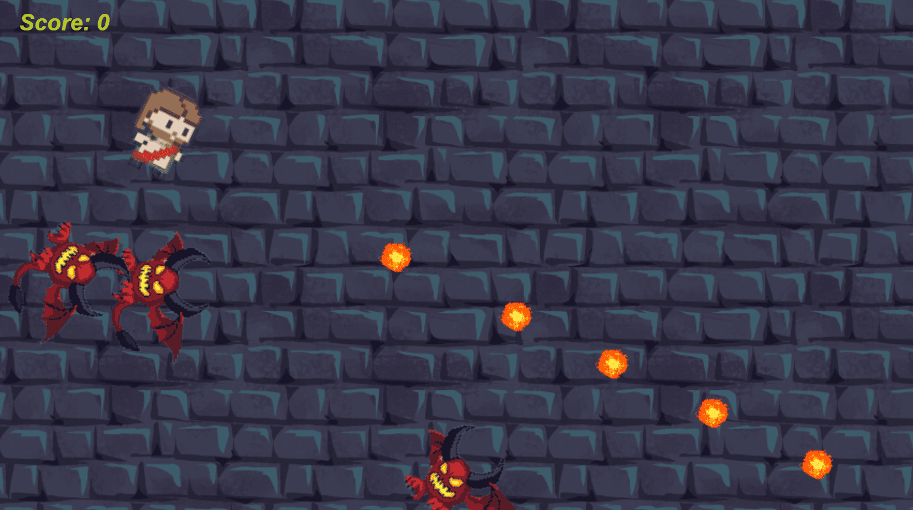
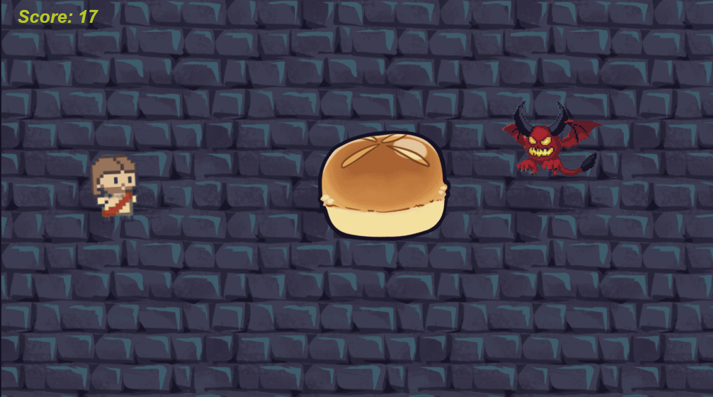
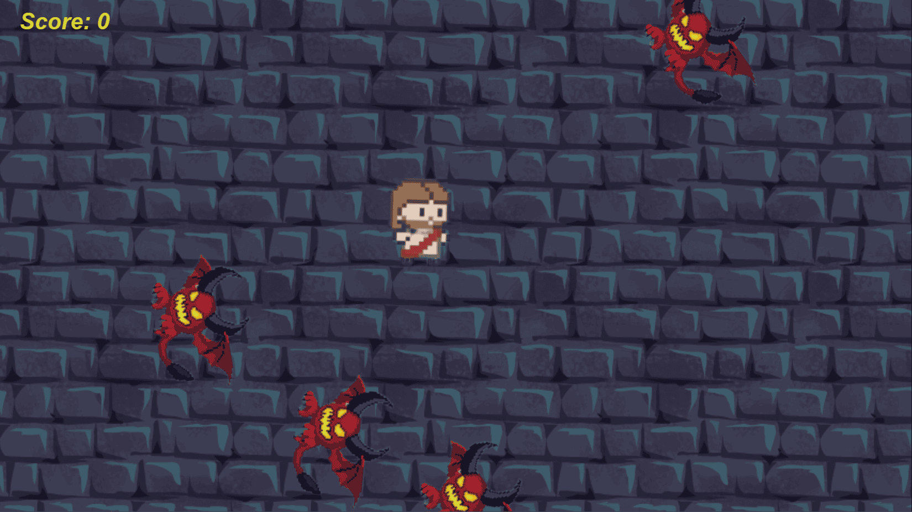

# 👑 Jesus vs Demônios - Jogo 2D com Banco de Dados NoSQL

Este projeto é um jogo 2D desenvolvido em sala de aula com integração com banco de dados NoSQL. O jogador controla Jesus em uma batalha contra demônios, utilizando ataques normais e especiais. O jogo salva e recupera informações do banco de dados, demonstrando uma integração funcional.

🔗 [Jogar Online](https://www.construct.net/en/free-online-games/jesus-vs-demonios-75585/play)

---

## 🎮 Como Jogar

- **Mover**: Setas do teclado ← ↑ → ↓  
- **Ataque normal**: Botão esquerdo do mouse  
- **Ataque especial**: Botão direito do mouse  

---

## 📦 Arquivo CP3

[📁 Baixar projeto Jesus Vs Demonios.c3p](./Jesus%20Vs%20Demonios.c3p)

---

## 🎨 Sprites

| Tipo                 | Arquivo                                           |
|----------------------|---------------------------------------------------|
| **Protagonista**     |              |
| **Inimigos**         | .png)     |
| **Ataque Normal**    |                 |
| **Ataque Especial**  |     |
| **Efeito de Acerto** |               |
| **Ícone do Jogo**    |                 |

---

## 🖼️ Imagens da Aplicação

| Tela                            | Imagem                                                  |
|---------------------------------|----------------------------------------------------------|
| Tela Principal                  |             |
| Tela de Fim                     |          |
| Gameplay 1                      |                          |
| Gameplay 2                      |                          |
| Gameplay 3                      |                          |

---

## 🗃️ Imagens do Banco de Dados

| Tela do banco de dados funcionando |
|-----------------------------------|
|  |

---

## 📝 Descrição

Este jogo foi criado como parte da atividade de integração de banco de dados NoSQL com jogos 2D. Foram feitas modificações, incluindo novos sprites, ataques personalizados e persistência de dados.

---

## ✔️ Pontos Avaliados

- [x] Integração com banco de dados (envio e recebimento)
- [x] Modificações gráficas (sprites, efeitos, inimigos)
- [x] README completo com prints, link e descrição
- [x] Arquivos do jogo incluídos

---

Desenvolvido para fins educacionais. 😄
